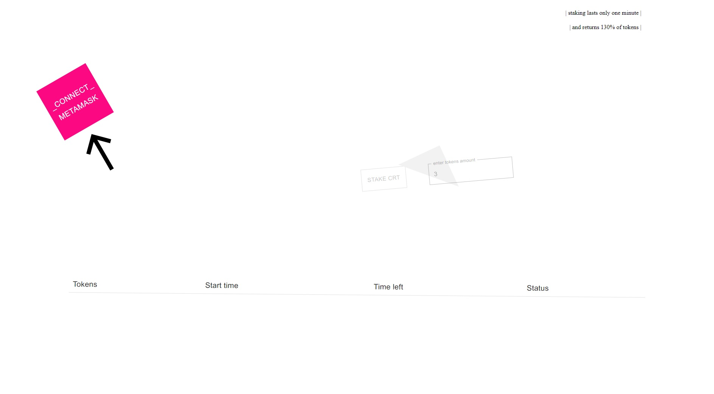
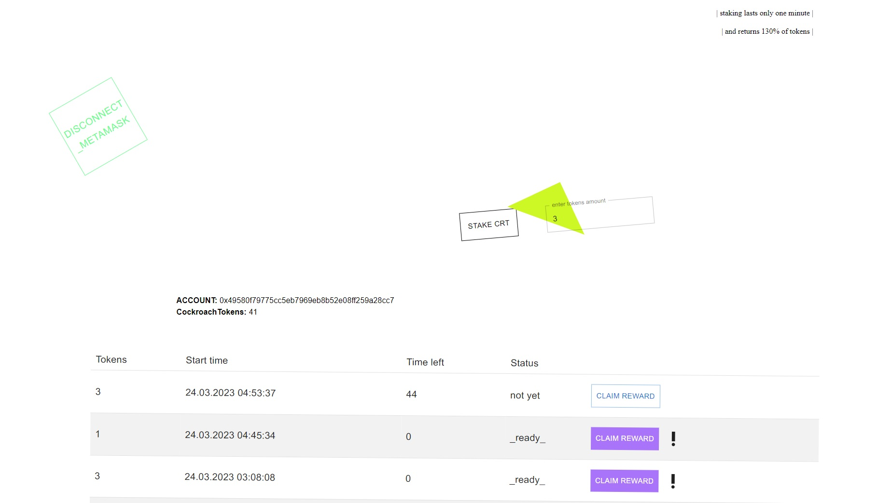
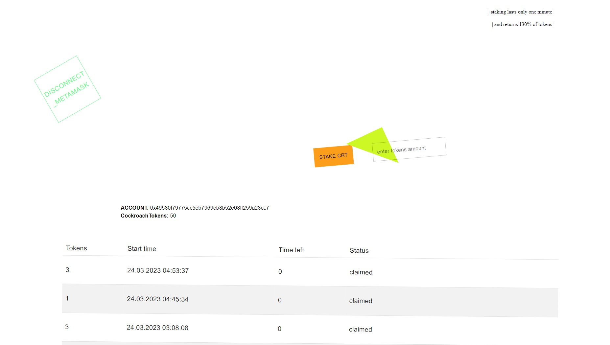

## Введение
Стейкинг – это процесс, при котором пользователь замораживает свои токены (ставит в залог) и получает вознаграждение по истечении некоторого времени. 

## Странности решения

Сейчас кнопка Claim Reward забирает не конкретный законченный стейкинг, а все.  
Просто потому, что я так написал в смарт-контракте. 

## Инструкция по запуску приложения на локальном блокчейне

**Запуск локального блокчейна:**
1. `yarn install`
2. `yarn hardhat node`
3. `yarn hardhat run scripts/deployCockroachToken.js --network localhost`
  
4. изменить в коде contracts/CockroachStaking.sol адрес в переменной token на полученый на шаге 3.
5. `yarn hardhat run scripts/deployCockroachStaking.js --network localhost`
  
6. изменить в файле .env следующие переменные: CrtAddress (контракт токена), CrsAddress (контракт для стейкинга), init_recipient (адрес вашего метамаск-аккаунта)
  
7. `yarn hardhat run scripts/initTransferTokens.js --network localhost` - это добавит некоторое кол-во токенов на счет контракта CockroachStaking и на счет аккаунта в метамаске. 
  
**Запуск приложения:**
1. поставить адреса CrtAddress и CrsAddress в front/src/addresses/contractAddresses на адрес CockroachToken и CockroachStaking соответственно.
2. `cd front`
3. `yarn install` (а нужно ли?)
4. `yarn dev`
5. Добавить в метамаске сеть локального блокчейна, порт которой был получен на шаге 2. Переключиться на эту сеть.
6. В браузере зайти на адрес, полученный на шаге 11, использовать приложение.

## Тестрование

Ни формального тестирования, ни юнит-тестирования не было.  
Но проверку на дурака я сделал.

## Что делать дальше?
* динамический, а не статический стейкинг

## Пара скриншотов

